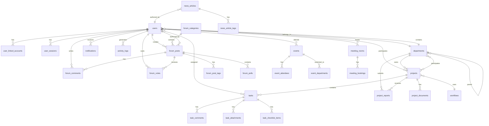

# 📊 Database Schema - Nexus Internal Portal

> **Tài liệu thiết kế cơ sở dữ liệu cho hệ thống Cổng thông tin nội bộ Nexus**
>
> Version: 1.0  
> Last Updated: December 8, 2025

---

## 📑 Mục lục

1. [Tổng quan](#tổng-quan)
2. [Sơ đồ ERD tổng thể](#sơ-đồ-erd-tổng-thể)
3. [Chi tiết các bảng](#chi-tiết-các-bảng)
   - [Module User & Organization](#module-user--organization)
   - [Module Projects & Tasks](#module-projects--tasks)
   - [Module Forum & Communication](#module-forum--communication)
   - [Module News & Content](#module-news--content)
   - [Module Workspace & Events](#module-workspace--events)
   - [Module System & Settings](#module-system--settings)
4. [Indexes & Optimization](#indexes--optimization)
5. [Migration Strategy](#migration-strategy)

---

## 🎯 Tổng quan

### Công nghệ đề xuất

- **Database**: PostgreSQL 15+ (hoặc MySQL 8.0+)
- **ORM**: Prisma / TypeORM / Sequelize
- **Cache**: Redis (cho session, real-time data)
- **Search**: Elasticsearch (optional cho full-text search)
- **File Storage**: AWS S3 / Azure Blob Storage

### Nguyên tắc thiết kế

- ✅ Normalization đến 3NF
- ✅ Sử dụng UUID cho primary keys
- ✅ Soft delete cho hầu hết các bảng
- ✅ Timestamps (created_at, updated_at, deleted_at)
- ✅ Foreign keys với CASCADE/RESTRICT phù hợp
- ✅ Indexes cho performance optimization

---

## 📐 Sơ đồ ERD tổng thể



---

## 📋 Chi tiết các bảng

---

## 🧑‍💼 Module User & Organization

### 1. `users`

Bảng chính quản lý thông tin nhân viên

| Column          | Type         | Constraints               | Description                    |
| --------------- | ------------ | ------------------------- | ------------------------------ |
| `id`            | UUID         | PRIMARY KEY               | User ID                        |
| `employee_id`   | VARCHAR(20)  | UNIQUE, NOT NULL          | Mã nhân viên (NEX-001)         |
| `full_name`     | VARCHAR(255) | NOT NULL                  | Họ và tên                      |
| `email`         | VARCHAR(255) | UNIQUE, NOT NULL          | Email công ty                  |
| `password_hash` | VARCHAR(255) | NOT NULL                  | Mật khẩu đã hash (bcrypt)      |
| `phone`         | VARCHAR(20)  |                           | Số điện thoại                  |
| `avatar_url`    | TEXT         |                           | Link ảnh đại diện              |
| `position`      | VARCHAR(100) |                           | Chức vụ                        |
| `department_id` | UUID         | FOREIGN KEY → departments | Phòng ban                      |
| `role`          | ENUM         | NOT NULL                  | 'Admin', 'Manager', 'Employee' |
| `status`        | ENUM         | DEFAULT 'Active'          | 'Active', 'Blocked', 'Pending' |
| `join_date`     | DATE         |                           | Ngày vào công ty               |
| `karma_points`  | INT          | DEFAULT 0                 | Điểm reputation                |
| `last_login_at` | TIMESTAMP    |                           | Lần đăng nhập cuối             |
| `created_at`    | TIMESTAMP    | DEFAULT NOW()             |                                |
| `updated_at`    | TIMESTAMP    | DEFAULT NOW()             |                                |
| `deleted_at`    | TIMESTAMP    | NULL                      | Soft delete                    |

**Indexes:**

```sql
CREATE INDEX idx_users_email ON users(email);
CREATE INDEX idx_users_employee_id ON users(employee_id);
CREATE INDEX idx_users_department ON users(department_id);
CREATE INDEX idx_users_status ON users(status) WHERE deleted_at IS NULL;
```

---

### 2. `departments`

Cơ cấu tổ chức phòng ban

| Column                 | Type          | Constraints               | Description                     |
| ---------------------- | ------------- | ------------------------- | ------------------------------- |
| `id`                   | UUID          | PRIMARY KEY               | Department ID                   |
| `name`                 | VARCHAR(255)  | UNIQUE, NOT NULL          | Tên phòng ban                   |
| `description`          | TEXT          |                           | Mô tả                           |
| `manager_id`           | UUID          | FOREIGN KEY → users       | Trưởng phòng                    |
| `parent_department_id` | UUID          | FOREIGN KEY → departments | Phòng ban cha (hierarchical)    |
| `budget`               | DECIMAL(15,2) |                           | Ngân sách (VND)                 |
| `kpi_status`           | ENUM          |                           | 'On Track', 'At Risk', 'Behind' |
| `created_at`           | TIMESTAMP     | DEFAULT NOW()             |                                 |
| `updated_at`           | TIMESTAMP     | DEFAULT NOW()             |                                 |
| `deleted_at`           | TIMESTAMP     | NULL                      |                                 |

**Indexes:**

```sql
CREATE INDEX idx_departments_parent ON departments(parent_department_id);
CREATE INDEX idx_departments_manager ON departments(manager_id);
```

---

### 3. `user_linked_accounts`

Liên kết tài khoản bên ngoài (Google, Microsoft, Slack, GitHub)

| Column                | Type         | Constraints         | Description                              |
| --------------------- | ------------ | ------------------- | ---------------------------------------- |
| `id`                  | UUID         | PRIMARY KEY         |                                          |
| `user_id`             | UUID         | FOREIGN KEY → users |                                          |
| `provider`            | ENUM         | NOT NULL            | 'google', 'microsoft', 'slack', 'github' |
| `provider_account_id` | VARCHAR(255) | NOT NULL            | ID tài khoản trên provider               |
| `provider_email`      | VARCHAR(255) |                     | Email trên provider                      |
| `access_token`        | TEXT         |                     | Encrypted token                          |
| `refresh_token`       | TEXT         |                     | Encrypted token                          |
| `expires_at`          | TIMESTAMP    |                     | Token expiry                             |
| `last_synced_at`      | TIMESTAMP    |                     | Lần sync cuối                            |
| `is_connected`        | BOOLEAN      | DEFAULT TRUE        |                                          |
| `created_at`          | TIMESTAMP    | DEFAULT NOW()       |                                          |
| `updated_at`          | TIMESTAMP    | DEFAULT NOW()       |                                          |

**Unique Constraint:**

```sql
UNIQUE (user_id, provider)
```

---

### 4. `user_sessions`

Quản lý phiên đăng nhập

| Column       | Type         | Constraints         | Description         |
| ------------ | ------------ | ------------------- | ------------------- |
| `id`         | UUID         | PRIMARY KEY         | Session ID          |
| `user_id`    | UUID         | FOREIGN KEY → users |                     |
| `token`      | VARCHAR(500) | UNIQUE, NOT NULL    | JWT/Session token   |
| `ip_address` | INET         |                     | IP đăng nhập        |
| `user_agent` | TEXT         |                     | Browser/Device info |
| `expires_at` | TIMESTAMP    | NOT NULL            |                     |
| `created_at` | TIMESTAMP    | DEFAULT NOW()       |                     |

**Indexes:**

```sql
CREATE INDEX idx_sessions_user ON user_sessions(user_id);
CREATE INDEX idx_sessions_token ON user_sessions(token);
CREATE INDEX idx_sessions_expires ON user_sessions(expires_at);
```

---

## 📁 Module Projects & Tasks

### 5. `projects`

Quản lý dự án

| Column        | Type          | Constraints             | Description                                 |
| ------------- | ------------- | ----------------------- | ------------------------------------------- |
| `id`          | UUID          | PRIMARY KEY             | Project ID                                  |
| `code`        | VARCHAR(50)   | UNIQUE, NOT NULL        | Mã dự án (WEB-2024)                         |
| `name`        | VARCHAR(255)  | NOT NULL                | Tên dự án                                   |
| `description` | TEXT          |                         | Mô tả                                       |
| `manager_id`  | UUID          | FOREIGN KEY → users     | Người quản lý                               |
| `workflow_id` | UUID          | FOREIGN KEY → workflows | Workflow áp dụng                            |
| `status`      | ENUM          | DEFAULT 'Planning'      | 'Planning', 'In Progress', 'Review', 'Done' |
| `priority`    | ENUM          | DEFAULT 'Medium'        | 'Low', 'Medium', 'High', 'Critical'         |
| `progress`    | INT           | DEFAULT 0               | Tiến độ % (0-100)                           |
| `budget`      | DECIMAL(15,2) |                         | Ngân sách                                   |
| `start_date`  | DATE          |                         |                                             |
| `end_date`    | DATE          |                         |                                             |
| `created_at`  | TIMESTAMP     | DEFAULT NOW()           |                                             |
| `updated_at`  | TIMESTAMP     | DEFAULT NOW()           |                                             |
| `deleted_at`  | TIMESTAMP     | NULL                    |                                             |

**Indexes:**

```sql
CREATE INDEX idx_projects_code ON projects(code);
CREATE INDEX idx_projects_status ON projects(status) WHERE deleted_at IS NULL;
CREATE INDEX idx_projects_manager ON projects(manager_id);
```

---

### 6. `project_departments`

Phòng ban tham gia dự án (Many-to-Many)

| Column          | Type         | Constraints               | Description                |
| --------------- | ------------ | ------------------------- | -------------------------- |
| `id`            | UUID         | PRIMARY KEY               |                            |
| `project_id`    | UUID         | FOREIGN KEY → projects    |                            |
| `department_id` | UUID         | FOREIGN KEY → departments |                            |
| `role`          | VARCHAR(100) |                           | Lead, Support, Collaborate |
| `assigned_at`   | TIMESTAMP    | DEFAULT NOW()             |                            |

**Unique Constraint:**

```sql
UNIQUE (project_id, department_id)
```

---

### 7. `tasks`

Nhiệm vụ trong dự án

| Column                   | Type         | Constraints               | Description                         |
| ------------------------ | ------------ | ------------------------- | ----------------------------------- |
| `id`                     | UUID         | PRIMARY KEY               | Task ID                             |
| `code`                   | VARCHAR(50)  | UNIQUE                    | Mã task (TASK-101)                  |
| `project_id`             | UUID         | FOREIGN KEY → projects    |                                     |
| `title`                  | VARCHAR(255) | NOT NULL                  | Tiêu đề task                        |
| `description`            | TEXT         |                           | Mô tả chi tiết                      |
| `assignee_department_id` | UUID         | FOREIGN KEY → departments | Phòng ban phụ trách                 |
| `status`                 | VARCHAR(50)  | NOT NULL                  | Trạng thái động theo workflow       |
| `priority`               | ENUM         | DEFAULT 'Medium'          | 'Low', 'Medium', 'High', 'Critical' |
| `start_date`             | DATE         |                           |                                     |
| `due_date`               | DATE         |                           |                                     |
| `completed_at`           | TIMESTAMP    |                           | Ngày hoàn thành                     |
| `created_by`             | UUID         | FOREIGN KEY → users       |                                     |
| `created_at`             | TIMESTAMP    | DEFAULT NOW()             |                                     |
| `updated_at`             | TIMESTAMP    | DEFAULT NOW()             |                                     |
| `deleted_at`             | TIMESTAMP    | NULL                      |                                     |

**Indexes:**

```sql
CREATE INDEX idx_tasks_project ON tasks(project_id);
CREATE INDEX idx_tasks_assignee_dept ON tasks(assignee_department_id);
CREATE INDEX idx_tasks_status ON tasks(status);
CREATE INDEX idx_tasks_due_date ON tasks(due_date) WHERE completed_at IS NULL;
```

---

### 8. `task_tags`

Tags cho task (Many-to-Many)

| Column     | Type        | Constraints         | Description                |
| ---------- | ----------- | ------------------- | -------------------------- |
| `id`       | UUID        | PRIMARY KEY         |                            |
| `task_id`  | UUID        | FOREIGN KEY → tasks |                            |
| `tag_name` | VARCHAR(50) | NOT NULL            | Design, Backend, Bug, etc. |

**Unique Constraint:**

```sql
UNIQUE (task_id, tag_name)
```

---

### 9. `task_checklist_items`

Checklist trong task

| Column         | Type         | Constraints         | Description     |
| -------------- | ------------ | ------------------- | --------------- |
| `id`           | UUID         | PRIMARY KEY         |                 |
| `task_id`      | UUID         | FOREIGN KEY → tasks |                 |
| `text`         | VARCHAR(500) | NOT NULL            | Nội dung item   |
| `is_completed` | BOOLEAN      | DEFAULT FALSE       |                 |
| `order`        | INT          | DEFAULT 0           | Thứ tự hiển thị |
| `created_at`   | TIMESTAMP    | DEFAULT NOW()       |                 |
| `updated_at`   | TIMESTAMP    | DEFAULT NOW()       |                 |

---

### 10. `task_comments`

Bình luận trong task

| Column       | Type      | Constraints         | Description |
| ------------ | --------- | ------------------- | ----------- |
| `id`         | UUID      | PRIMARY KEY         |             |
| `task_id`    | UUID      | FOREIGN KEY → tasks |             |
| `user_id`    | UUID      | FOREIGN KEY → users |             |
| `content`    | TEXT      | NOT NULL            |             |
| `created_at` | TIMESTAMP | DEFAULT NOW()       |             |
| `updated_at` | TIMESTAMP | DEFAULT NOW()       |             |
| `deleted_at` | TIMESTAMP | NULL                |             |

---

### 11. `task_attachments`

File đính kèm task

| Column        | Type         | Constraints         | Description           |
| ------------- | ------------ | ------------------- | --------------------- |
| `id`          | UUID         | PRIMARY KEY         |                       |
| `task_id`     | UUID         | FOREIGN KEY → tasks |                       |
| `file_name`   | VARCHAR(255) | NOT NULL            |                       |
| `file_url`    | TEXT         | NOT NULL            | S3/Blob URL           |
| `file_type`   | VARCHAR(50)  |                     | image, pdf, doc, etc. |
| `file_size`   | BIGINT       |                     | Bytes                 |
| `uploaded_by` | UUID         | FOREIGN KEY → users |                       |
| `uploaded_at` | TIMESTAMP    | DEFAULT NOW()       |                       |

---

### 12. `project_documents`

Tài liệu chung của dự án

| Column        | Type         | Constraints            | Description                 |
| ------------- | ------------ | ---------------------- | --------------------------- |
| `id`          | UUID         | PRIMARY KEY            |                             |
| `project_id`  | UUID         | FOREIGN KEY → projects |                             |
| `name`        | VARCHAR(255) | NOT NULL               |                             |
| `url`         | TEXT         | NOT NULL               |                             |
| `source`      | ENUM         |                        | 'Project', 'Task', 'Report' |
| `uploader_id` | UUID         | FOREIGN KEY → users    |                             |
| `uploaded_at` | TIMESTAMP    | DEFAULT NOW()          |                             |

---

### 13. `project_reports`

Báo cáo dự án từ phòng ban

| Column           | Type         | Constraints               | Description                       |
| ---------------- | ------------ | ------------------------- | --------------------------------- |
| `id`             | UUID         | PRIMARY KEY               |                                   |
| `project_id`     | UUID         | FOREIGN KEY → projects    |                                   |
| `department_id`  | UUID         | FOREIGN KEY → departments |                                   |
| `title`          | VARCHAR(255) | NOT NULL                  |                                   |
| `content`        | TEXT         | NOT NULL                  |                                   |
| `submitted_by`   | UUID         | FOREIGN KEY → users       |                                   |
| `submitted_date` | TIMESTAMP    | DEFAULT NOW()             |                                   |
| `status`         | ENUM         | DEFAULT 'Pending'         | 'Pending', 'Approved', 'Rejected' |
| `feedback`       | TEXT         |                           | Phản hồi từ quản lý               |
| `reviewed_by`    | UUID         | FOREIGN KEY → users       |                                   |
| `reviewed_at`    | TIMESTAMP    |                           |                                   |
| `created_at`     | TIMESTAMP    | DEFAULT NOW()             |                                   |
| `updated_at`     | TIMESTAMP    | DEFAULT NOW()             |                                   |

---

### 14. `workflows`

Workflow templates cho dự án

| Column        | Type         | Constraints         | Description           |
| ------------- | ------------ | ------------------- | --------------------- |
| `id`          | UUID         | PRIMARY KEY         |                       |
| `name`        | VARCHAR(100) | UNIQUE, NOT NULL    | Scrum, Kanban, Custom |
| `description` | TEXT         |                     |                       |
| `is_default`  | BOOLEAN      | DEFAULT FALSE       |                       |
| `created_by`  | UUID         | FOREIGN KEY → users |                       |
| `created_at`  | TIMESTAMP    | DEFAULT NOW()       |                       |
| `updated_at`  | TIMESTAMP    | DEFAULT NOW()       |                       |

---

### 15. `workflow_statuses`

Trạng thái trong workflow

| Column        | Type        | Constraints             | Description              |
| ------------- | ----------- | ----------------------- | ------------------------ |
| `id`          | UUID        | PRIMARY KEY             |                          |
| `workflow_id` | UUID        | FOREIGN KEY → workflows |                          |
| `name`        | VARCHAR(50) | NOT NULL                | To Do, In Progress, Done |
| `color`       | VARCHAR(20) |                         | Hex code                 |
| `order`       | INT         | DEFAULT 0               | Thứ tự hiển thị          |

---

## 💬 Module Forum & Communication

### 16. `forum_categories`

Danh mục forum

| Column        | Type         | Constraints      | Description      |
| ------------- | ------------ | ---------------- | ---------------- |
| `id`          | UUID         | PRIMARY KEY      |                  |
| `name`        | VARCHAR(100) | UNIQUE, NOT NULL |                  |
| `description` | TEXT         |                  |                  |
| `icon`        | VARCHAR(50)  |                  | Lucide icon name |
| `color_class` | VARCHAR(50)  |                  | Tailwind class   |
| `order`       | INT          | DEFAULT 0        |                  |
| `created_at`  | TIMESTAMP    | DEFAULT NOW()    |                  |
| `updated_at`  | TIMESTAMP    | DEFAULT NOW()    |                  |

---

### 17. `forum_posts`

Bài viết forum

| Column           | Type         | Constraints                    | Description                       |
| ---------------- | ------------ | ------------------------------ | --------------------------------- |
| `id`             | UUID         | PRIMARY KEY                    |                                   |
| `category_id`    | UUID         | FOREIGN KEY → forum_categories |                                   |
| `author_id`      | UUID         | FOREIGN KEY → users            |                                   |
| `title`          | VARCHAR(500) | NOT NULL                       |                                   |
| `content`        | TEXT         | NOT NULL                       | Markdown/HTML                     |
| `status`         | ENUM         | DEFAULT 'Pending'              | 'Pending', 'Approved', 'Rejected' |
| `is_pinned`      | BOOLEAN      | DEFAULT FALSE                  | Ghim bài                          |
| `view_count`     | INT          | DEFAULT 0                      | Lượt xem                          |
| `upvote_count`   | INT          | DEFAULT 0                      | Cache count                       |
| `downvote_count` | INT          | DEFAULT 0                      | Cache count                       |
| `comment_count`  | INT          | DEFAULT 0                      | Cache count                       |
| `created_at`     | TIMESTAMP    | DEFAULT NOW()                  |                                   |
| `updated_at`     | TIMESTAMP    | DEFAULT NOW()                  |                                   |
| `deleted_at`     | TIMESTAMP    | NULL                           |                                   |

**Indexes:**

```sql
CREATE INDEX idx_forum_posts_category ON forum_posts(category_id);
CREATE INDEX idx_forum_posts_author ON forum_posts(author_id);
CREATE INDEX idx_forum_posts_status ON forum_posts(status) WHERE deleted_at IS NULL;
CREATE INDEX idx_forum_posts_pinned ON forum_posts(is_pinned, created_at DESC);
```

---

### 18. `forum_post_tags`

Tags cho bài viết (Many-to-Many)

| Column     | Type        | Constraints               | Description |
| ---------- | ----------- | ------------------------- | ----------- |
| `id`       | UUID        | PRIMARY KEY               |             |
| `post_id`  | UUID        | FOREIGN KEY → forum_posts |             |
| `tag_name` | VARCHAR(50) | NOT NULL                  |             |

**Unique Constraint:**

```sql
UNIQUE (post_id, tag_name)
```

---

### 19. `forum_comments`

Bình luận forum

| Column           | Type      | Constraints                  | Description    |
| ---------------- | --------- | ---------------------------- | -------------- |
| `id`             | UUID      | PRIMARY KEY                  |                |
| `post_id`        | UUID      | FOREIGN KEY → forum_posts    |                |
| `author_id`      | UUID      | FOREIGN KEY → users          |                |
| `parent_id`      | UUID      | FOREIGN KEY → forum_comments | Nested comment |
| `content`        | TEXT      | NOT NULL                     |                |
| `upvote_count`   | INT       | DEFAULT 0                    |                |
| `downvote_count` | INT       | DEFAULT 0                    |                |
| `created_at`     | TIMESTAMP | DEFAULT NOW()                |                |
| `updated_at`     | TIMESTAMP | DEFAULT NOW()                |                |
| `deleted_at`     | TIMESTAMP | NULL                         |                |

**Indexes:**

```sql
CREATE INDEX idx_forum_comments_post ON forum_comments(post_id);
CREATE INDEX idx_forum_comments_parent ON forum_comments(parent_id);
```

---

### 20. `forum_votes`

Vote cho bài viết/comment

| Column         | Type      | Constraints         | Description               |
| -------------- | --------- | ------------------- | ------------------------- |
| `id`           | UUID      | PRIMARY KEY         |                           |
| `user_id`      | UUID      | FOREIGN KEY → users |                           |
| `votable_type` | ENUM      | NOT NULL            | 'post', 'comment'         |
| `votable_id`   | UUID      | NOT NULL            | ID của post hoặc comment  |
| `vote_type`    | INT       | NOT NULL            | 1 (upvote), -1 (downvote) |
| `created_at`   | TIMESTAMP | DEFAULT NOW()       |                           |

**Unique Constraint:**

```sql
UNIQUE (user_id, votable_type, votable_id)
```

---

### 21. `forum_polls`

Poll trong bài viết

| Column       | Type         | Constraints               | Description |
| ------------ | ------------ | ------------------------- | ----------- |
| `id`         | UUID         | PRIMARY KEY               |             |
| `post_id`    | UUID         | FOREIGN KEY → forum_posts |             |
| `question`   | VARCHAR(500) | NOT NULL                  |             |
| `end_date`   | TIMESTAMP    |                           | Hạn vote    |
| `created_at` | TIMESTAMP    | DEFAULT NOW()             |             |

---

### 22. `forum_poll_options`

Các lựa chọn trong poll

| Column       | Type         | Constraints               | Description |
| ------------ | ------------ | ------------------------- | ----------- |
| `id`         | UUID         | PRIMARY KEY               |             |
| `poll_id`    | UUID         | FOREIGN KEY → forum_polls |             |
| `text`       | VARCHAR(255) | NOT NULL                  |             |
| `vote_count` | INT          | DEFAULT 0                 | Cache count |
| `order`      | INT          | DEFAULT 0                 |             |

---

### 23. `forum_poll_votes`

Vote cho poll

| Column      | Type      | Constraints                      | Description |
| ----------- | --------- | -------------------------------- | ----------- |
| `id`        | UUID      | PRIMARY KEY                      |             |
| `poll_id`   | UUID      | FOREIGN KEY → forum_polls        |             |
| `option_id` | UUID      | FOREIGN KEY → forum_poll_options |             |
| `user_id`   | UUID      | FOREIGN KEY → users              |             |
| `voted_at`  | TIMESTAMP | DEFAULT NOW()                    |             |

**Unique Constraint:**

```sql
UNIQUE (poll_id, user_id)
```

---

### 24. `forum_saved_posts`

Bài viết đã lưu của user

| Column     | Type      | Constraints               | Description |
| ---------- | --------- | ------------------------- | ----------- |
| `id`       | UUID      | PRIMARY KEY               |             |
| `user_id`  | UUID      | FOREIGN KEY → users       |             |
| `post_id`  | UUID      | FOREIGN KEY → forum_posts |             |
| `saved_at` | TIMESTAMP | DEFAULT NOW()             |             |

**Unique Constraint:**

```sql
UNIQUE (user_id, post_id)
```

---

### 25. `forum_subscriptions`

Theo dõi bài viết

| Column          | Type      | Constraints               | Description |
| --------------- | --------- | ------------------------- | ----------- |
| `id`            | UUID      | PRIMARY KEY               |             |
| `user_id`       | UUID      | FOREIGN KEY → users       |             |
| `post_id`       | UUID      | FOREIGN KEY → forum_posts |             |
| `subscribed_at` | TIMESTAMP | DEFAULT NOW()             |             |

**Unique Constraint:**

```sql
UNIQUE (user_id, post_id)
```

---

## 📰 Module News & Content

### 26. `news_articles`

Tin tức nội bộ

| Column         | Type         | Constraints         | Description                                    |
| -------------- | ------------ | ------------------- | ---------------------------------------------- |
| `id`           | UUID         | PRIMARY KEY         |                                                |
| `title`        | VARCHAR(500) | NOT NULL            |                                                |
| `summary`      | TEXT         |                     | Tóm tắt                                        |
| `content`      | TEXT         | NOT NULL            | HTML content                                   |
| `cover_image`  | TEXT         |                     | URL ảnh bìa                                    |
| `category`     | ENUM         | NOT NULL            | 'Strategy', 'Event', 'Culture', 'Announcement' |
| `author_id`    | UUID         | FOREIGN KEY → users |                                                |
| `status`       | ENUM         | DEFAULT 'Draft'     | 'Draft', 'Published', 'Archived'               |
| `is_featured`  | BOOLEAN      | DEFAULT FALSE       | Bài nổi bật                                    |
| `read_time`    | VARCHAR(20)  |                     | "5 phút đọc"                                   |
| `view_count`   | INT          | DEFAULT 0           |                                                |
| `published_at` | TIMESTAMP    |                     |                                                |
| `created_at`   | TIMESTAMP    | DEFAULT NOW()       |                                                |
| `updated_at`   | TIMESTAMP    | DEFAULT NOW()       |                                                |
| `deleted_at`   | TIMESTAMP    | NULL                |                                                |

**Indexes:**

```sql
CREATE INDEX idx_news_status ON news_articles(status, published_at DESC);
CREATE INDEX idx_news_category ON news_articles(category);
CREATE INDEX idx_news_featured ON news_articles(is_featured) WHERE status = 'Published';
```

---

### 27. `news_article_tags`

Tags cho tin tức

| Column       | Type        | Constraints                 | Description |
| ------------ | ----------- | --------------------------- | ----------- |
| `id`         | UUID        | PRIMARY KEY                 |             |
| `article_id` | UUID        | FOREIGN KEY → news_articles |             |
| `tag_name`   | VARCHAR(50) | NOT NULL                    |             |

**Unique Constraint:**

```sql
UNIQUE (article_id, tag_name)
```

---

## 🎉 Module Workspace & Events

### 28. `events`

Sự kiện công ty

| Column           | Type         | Constraints         | Description                                           |
| ---------------- | ------------ | ------------------- | ----------------------------------------------------- |
| `id`             | UUID         | PRIMARY KEY         |                                                       |
| `title`          | VARCHAR(255) | NOT NULL            |                                                       |
| `description`    | TEXT         |                     |                                                       |
| `type`           | ENUM         | NOT NULL            | 'Workshop', 'Seminar', 'Party', 'Training', 'Meeting' |
| `location`       | VARCHAR(255) |                     |                                                       |
| `start_datetime` | TIMESTAMP    | NOT NULL            |                                                       |
| `end_datetime`   | TIMESTAMP    | NOT NULL            |                                                       |
| `max_attendees`  | INT          |                     | Giới hạn người tham gia                               |
| `access_level`   | ENUM         | DEFAULT 'Public'    | 'Public', 'Private'                                   |
| `status`         | ENUM         | DEFAULT 'Upcoming'  | 'Upcoming', 'Ongoing', 'Completed', 'Cancelled'       |
| `organizer_id`   | UUID         | FOREIGN KEY → users |                                                       |
| `created_at`     | TIMESTAMP    | DEFAULT NOW()       |                                                       |
| `updated_at`     | TIMESTAMP    | DEFAULT NOW()       |                                                       |
| `deleted_at`     | TIMESTAMP    | NULL                |                                                       |

**Indexes:**

```sql
CREATE INDEX idx_events_start ON events(start_datetime);
CREATE INDEX idx_events_status ON events(status);
```

---

### 29. `event_departments`

Phòng ban được mời tham gia event (Private)

| Column          | Type | Constraints               | Description |
| --------------- | ---- | ------------------------- | ----------- |
| `id`            | UUID | PRIMARY KEY               |             |
| `event_id`      | UUID | FOREIGN KEY → events      |             |
| `department_id` | UUID | FOREIGN KEY → departments |             |

**Unique Constraint:**

```sql
UNIQUE (event_id, department_id)
```

---

### 30. `event_attendees`

Danh sách tham dự

| Column          | Type      | Constraints          | Description                           |
| --------------- | --------- | -------------------- | ------------------------------------- |
| `id`            | UUID      | PRIMARY KEY          |                                       |
| `event_id`      | UUID      | FOREIGN KEY → events |                                       |
| `user_id`       | UUID      | FOREIGN KEY → users  |                                       |
| `status`        | ENUM      | DEFAULT 'Registered' | 'Registered', 'Attended', 'Cancelled' |
| `registered_at` | TIMESTAMP | DEFAULT NOW()        |                                       |
| `attended_at`   | TIMESTAMP |                      | Check-in                              |

**Unique Constraint:**

```sql
UNIQUE (event_id, user_id)
```

---

### 31. `meeting_rooms`

Phòng họp

| Column         | Type         | Constraints         | Description                            |
| -------------- | ------------ | ------------------- | -------------------------------------- |
| `id`           | UUID         | PRIMARY KEY         |                                        |
| `name`         | VARCHAR(100) | UNIQUE, NOT NULL    |                                        |
| `type`         | ENUM         | NOT NULL            | 'Physical', 'Online'                   |
| `location`     | VARCHAR(255) |                     | Tầng, toà nhà                          |
| `capacity`     | INT          |                     | Sức chứa                               |
| `meeting_link` | TEXT         |                     | Zoom/Teams link                        |
| `facilities`   | JSON         |                     | ['Projector', 'Whiteboard']            |
| `status`       | ENUM         | DEFAULT 'Available' | 'Available', 'Maintenance', 'Disabled' |
| `created_at`   | TIMESTAMP    | DEFAULT NOW()       |                                        |
| `updated_at`   | TIMESTAMP    | DEFAULT NOW()       |                                        |

---

### 32. `meeting_bookings`

Đặt phòng họp

| Column           | Type         | Constraints                 | Description              |
| ---------------- | ------------ | --------------------------- | ------------------------ |
| `id`             | UUID         | PRIMARY KEY                 |                          |
| `room_id`        | UUID         | FOREIGN KEY → meeting_rooms |                          |
| `title`          | VARCHAR(255) | NOT NULL                    |                          |
| `organizer_id`   | UUID         | FOREIGN KEY → users         |                          |
| `start_datetime` | TIMESTAMP    | NOT NULL                    |                          |
| `end_datetime`   | TIMESTAMP    | NOT NULL                    |                          |
| `attendees`      | JSON         |                             | Array of user IDs        |
| `status`         | ENUM         | DEFAULT 'Confirmed'         | 'Confirmed', 'Cancelled' |
| `created_at`     | TIMESTAMP    | DEFAULT NOW()               |                          |
| `updated_at`     | TIMESTAMP    | DEFAULT NOW()               |                          |

**Indexes:**

```sql
CREATE INDEX idx_bookings_room_time ON meeting_bookings(room_id, start_datetime, end_datetime);
```

---

## ⚙️ Module System & Settings

### 33. `notifications`

Thông báo cho user

| Column       | Type         | Constraints         | Description                              |
| ------------ | ------------ | ------------------- | ---------------------------------------- |
| `id`         | UUID         | PRIMARY KEY         |                                          |
| `user_id`    | UUID         | FOREIGN KEY → users |                                          |
| `type`       | ENUM         | NOT NULL            | 'comment', 'upvote', 'mention', 'system' |
| `title`      | VARCHAR(255) | NOT NULL            |                                          |
| `message`    | TEXT         | NOT NULL            |                                          |
| `link`       | TEXT         |                     | Deeplink vào nội dung                    |
| `actor_id`   | UUID         | FOREIGN KEY → users | Người thực hiện action                   |
| `is_read`    | BOOLEAN      | DEFAULT FALSE       |                                          |
| `created_at` | TIMESTAMP    | DEFAULT NOW()       |                                          |

**Indexes:**

```sql
CREATE INDEX idx_notifications_user ON notifications(user_id, is_read, created_at DESC);
```

---

### 34. `activity_logs`

Nhật ký hoạt động hệ thống

| Column       | Type         | Constraints         | Description                                                                                                       |
| ------------ | ------------ | ------------------- | ----------------------------------------------------------------------------------------------------------------- |
| `id`         | UUID         | PRIMARY KEY         |                                                                                                                   |
| `user_id`    | UUID         | FOREIGN KEY → users |                                                                                                                   |
| `type`       | ENUM         | NOT NULL            | 'post_create', 'comment', 'task_complete', 'login', 'profile_update', 'system', 'personnel_change', 'data_backup' |
| `content`    | TEXT         | NOT NULL            | Mô tả hành động                                                                                                   |
| `target`     | VARCHAR(255) |                     | Đối tượng tác động                                                                                                |
| `ip_address` | INET         |                     |                                                                                                                   |
| `meta`       | JSON         |                     | Extra data (oldVal, newVal)                                                                                       |
| `created_at` | TIMESTAMP    | DEFAULT NOW()       |                                                                                                                   |

**Indexes:**

```sql
CREATE INDEX idx_activity_logs_user ON activity_logs(user_id, created_at DESC);
CREATE INDEX idx_activity_logs_type ON activity_logs(type, created_at DESC);
CREATE INDEX idx_activity_logs_created ON activity_logs(created_at DESC);
```

---

### 35. `alert_rules`

Quy tắc cảnh báo tự động

| Column         | Type          | Constraints      | Description                |
| -------------- | ------------- | ---------------- | -------------------------- |
| `id`           | UUID          | PRIMARY KEY      |                            |
| `name`         | VARCHAR(100)  | UNIQUE, NOT NULL |                            |
| `description`  | TEXT          |                  |                            |
| `category`     | ENUM          | NOT NULL         | 'HR', 'System', 'Security' |
| `threshold`    | DECIMAL(10,2) | NOT NULL         | Ngưỡng kích hoạt           |
| `unit`         | ENUM          | NOT NULL         | 'days', 'percent', 'count' |
| `notify_roles` | JSON          |                  | ['Admin', 'Manager']       |
| `is_enabled`   | BOOLEAN       | DEFAULT TRUE     |                            |
| `created_at`   | TIMESTAMP     | DEFAULT NOW()    |                            |
| `updated_at`   | TIMESTAMP     | DEFAULT NOW()    |                            |

---

### 36. `backup_files`

Lịch sử backup

| Column          | Type         | Constraints       | Description                    |
| --------------- | ------------ | ----------------- | ------------------------------ |
| `id`            | UUID         | PRIMARY KEY       |                                |
| `file_name`     | VARCHAR(255) | NOT NULL          |                                |
| `file_size`     | BIGINT       |                   | Bytes                          |
| `type`          | ENUM         | NOT NULL          | 'Full', 'Incremental'          |
| `status`        | ENUM         | DEFAULT 'Pending' | 'Pending', 'Success', 'Failed' |
| `error_message` | TEXT         |                   | Nếu failed                     |
| `created_at`    | TIMESTAMP    | DEFAULT NOW()     |                                |

---

### 37. `system_settings`

Cấu hình hệ thống

| Column        | Type         | Constraints         | Description                       |
| ------------- | ------------ | ------------------- | --------------------------------- |
| `id`          | UUID         | PRIMARY KEY         |                                   |
| `key`         | VARCHAR(100) | UNIQUE, NOT NULL    | maintenance_mode, language, theme |
| `value`       | TEXT         | NOT NULL            | JSON string                       |
| `description` | TEXT         |                     |                                   |
| `updated_by`  | UUID         | FOREIGN KEY → users |                                   |
| `updated_at`  | TIMESTAMP    | DEFAULT NOW()       |                                   |

---

## 🔍 Indexes & Optimization

### Composite Indexes

```sql
-- Performance cho Dashboard Overview
CREATE INDEX idx_users_active_count ON users(status) WHERE deleted_at IS NULL;
CREATE INDEX idx_projects_active_progress ON projects(status, progress) WHERE deleted_at IS NULL;

-- Forum hot posts
CREATE INDEX idx_forum_posts_hot ON forum_posts(category_id, upvote_count DESC, created_at DESC) WHERE status = 'Approved';

-- Task deadline tracking
CREATE INDEX idx_tasks_overdue ON tasks(due_date, status) WHERE completed_at IS NULL AND deleted_at IS NULL;

-- Full-text search (PostgreSQL)
CREATE INDEX idx_forum_posts_fts ON forum_posts USING GIN(to_tsvector('english', title || ' ' || content));
CREATE INDEX idx_news_articles_fts ON news_articles USING GIN(to_tsvector('english', title || ' ' || summary));
```

---

## 🚀 Migration Strategy

### Phase 1: Core Modules (Week 1-2)

1. Users & Departments
2. User Sessions & Linked Accounts
3. System Settings & Activity Logs

### Phase 2: Projects & Tasks (Week 3-4)

1. Projects & Workflows
2. Tasks & Subtasks
3. Project Reports

### Phase 3: Communication (Week 5-6)

1. Forum Categories & Posts
2. Comments & Votes
3. Polls

### Phase 4: Content & Events (Week 7-8)

1. News Articles
2. Events & Attendees
3. Meeting Rooms & Bookings

### Phase 5: System Features (Week 9-10)

1. Notifications
2. Alert Rules
3. Backup Management

---

## 📌 Notes & Best Practices

### Soft Delete Pattern

```sql
-- Sử dụng deleted_at thay vì hard delete
UPDATE users SET deleted_at = NOW() WHERE id = 'xxx';

-- Query không bao gồm deleted rows
SELECT * FROM users WHERE deleted_at IS NULL;
```

### JSON Fields Usage

- `meeting_rooms.facilities`: `["Projector", "Whiteboard", "TV"]`
- `activity_logs.meta`: `{"oldValue": "Active", "newValue": "Blocked"}`
- `system_settings.value`: `{"enabled": true, "threshold": 30}`

### Enum Values Reference

```sql
-- user.role
ENUM('Admin', 'Manager', 'Employee')

-- user.status
ENUM('Active', 'Blocked', 'Pending')

-- project.status
ENUM('Planning', 'In Progress', 'Review', 'Done')

-- task.priority
ENUM('Low', 'Medium', 'High', 'Critical')

-- news_article.category
ENUM('Strategy', 'Event', 'Culture', 'Announcement')

-- event.type
ENUM('Workshop', 'Seminar', 'Party', 'Training', 'Meeting')
```

---

## 🎓 Tài liệu tham khảo

- **PostgreSQL Documentation**: https://www.postgresql.org/docs/
- **Database Normalization**: https://en.wikipedia.org/wiki/Database_normalization
- **Prisma Schema**: https://www.prisma.io/docs/concepts/components/prisma-schema
- **TypeORM Relations**: https://typeorm.io/relations

---

**Prepared by**: AI Assistant  
**For**: Nexus Corp Internal Portal Project  
**Contact**: Dev Team - dev@nexus.com
